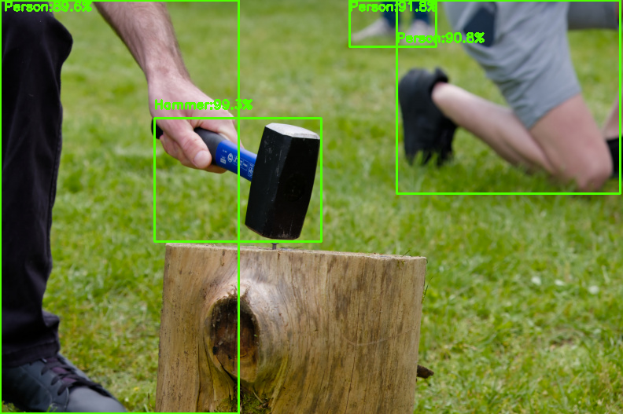
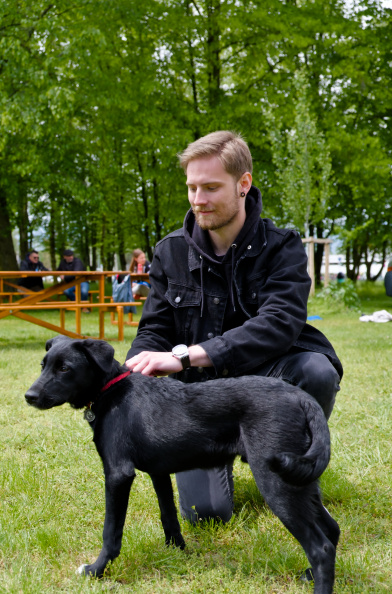
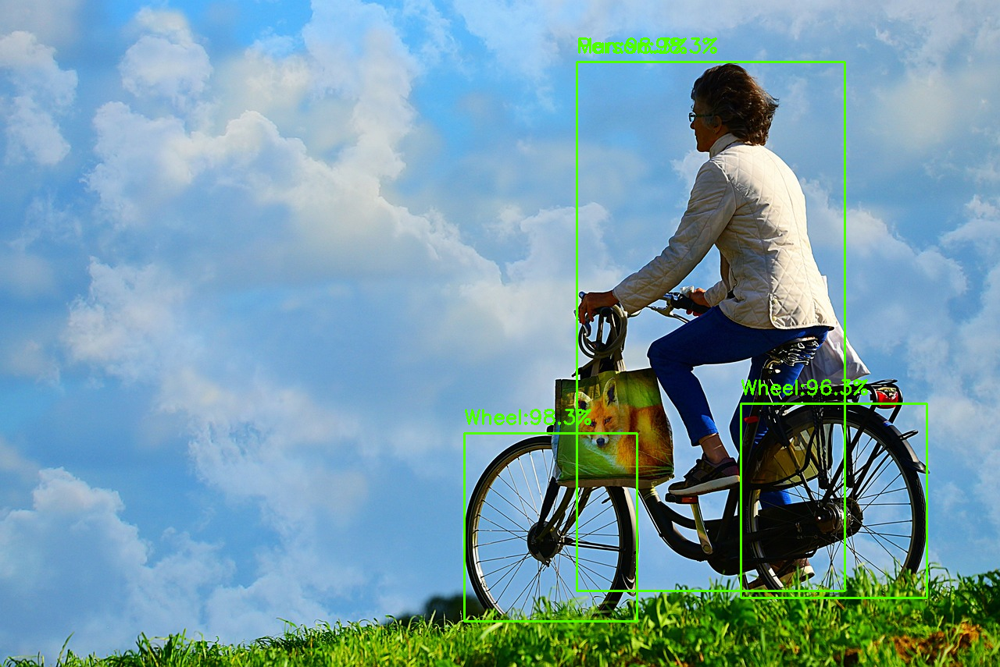

# Amazon Rekognition - Detecting labels in an image

[Official documentation](https://docs.aws.amazon.com/rekognition/latest/dg/labels.html?pg=ln&sec=ft)

## Scenario

_Given_

Our label detector service is up and running, and images are uploaded to the Amazon S3 bucket

_When_

Rekognition is called

_Then_
  
The image is processed, and labels are annotated on the image and uploaded to the Amazon S3 bucket.

## Demonstration

### Step 0: Create an S3 bucket, and upload images

We already have an S3 bucket created, and images are uploaded to the bucket using the `setup_label_detection.py` script. It takes the images from the local `images` folder and uploads them to the S3 bucket.

TODO ajouter l'explication sur les problèmes de zones

### Step 1: Launch the script

Once the images are uploaded, we can launch the script to detect labels in the images. The script is `detect_labels.py`. It takes the images from the S3 bucket, processes them, and uploads the processed images to the S3 bucket again.

TODO expliquer le choix des couleurs, des paramètres choisis pour les labels
TODO expliquer le fonctionnement grossier de Rekognition pour labels

### Step 2: Profit

The annotated images are now in the S3 bucket. We also save the annotated images in the local `annotated_images` folder, and you can enjoy the results there. We did not implement a script to retrieve the annotated images from the bucket as it felt a bit redundant and was not the focus of this demonstration.

## Results

### Image that works well

Here we have an example of image that works well with the Rekognition label detection. The labels are accurate, and the bounding boxes are well placed. We can also see that Rekognition is able to detect a person even when there are just blurry feets in the background.

### Labels that don't have bounding boxes

In some cases, Rekognition is able to detect labels, but does not provide a bounding box for them. We can interpret that as Rekognition detecting the recurring theme of the image, but not objects. We can see an example of this in the image below, where the label `Park` is detected, but no bounding box is provided.

TODO check si sources

### Overlapping bounding boxes

Here we have an example of image where two bounding boxes overlap, making the labels unreadable. We fixed it by shifting the labels down a bit, but it is not a perfect solution as it does not check all corner cases.

Fixed image:

## Possible ameliorations

- Pick a color scheme for each parent label category
- Better handle the overlapping bounding boxes (think more about corner cases when shifting the text labels, only keep the label with the higher certainty when bounding boxes are the same, ...)
- Deploy a GUI version
- ...